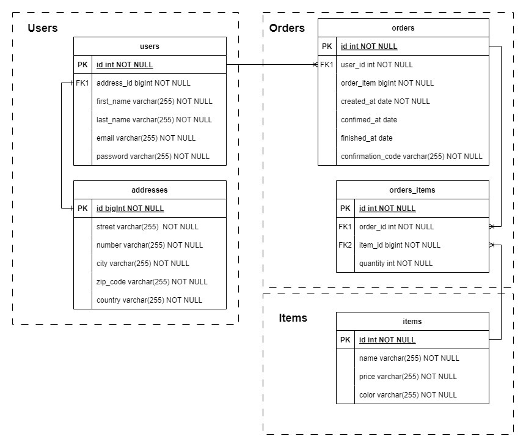

The application is designed for users to make orders.

It allows adding users and retrieving a list of users. An avatar in the form of a link to a dog photo from the internet is automatically assigned to all newly registered users. The retrieval of avatars is possible thanks to a connection with an external API.

The application also enables adding items and retrieving them.

The application allows users to place orders. Orders are stored in a MySQL database. For each order, we can track its status (NEW, CONFIRMED, COMPLETED, CANCELLED).

To confirm an order, it is necessary to enter the confirmationCode, which the user receives on email provided during registration.

Users have the option to cancel or complete an order.

To configure email sending locally, you need to fill in the properties spring.mail.username and spring.mail.password. It is also necessary to disable any antivirus software that blocks email sending from the application (this issue has been observed on Windows).

The application includes a docker-compose file that allows for the local setup of a MySQL database as well as the entire application.

Documentation for the application can be accessed using Swagger at the address "/swagger".

Example aplication's flow:
1. Create an user
2. Create an item / items
3. Check ids of these items / users using GET endpoint
4. Create an order (in case of status code 500 turn off the antivirus)
5. Confirm the order - use confirmationCode from your email
6. Complete/Cancel order

Schemat bazy danych

